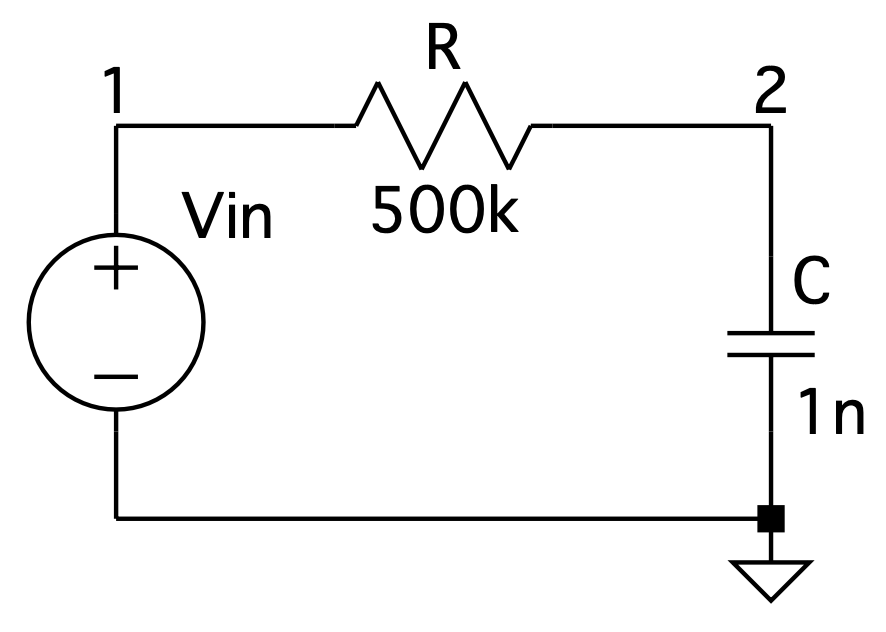
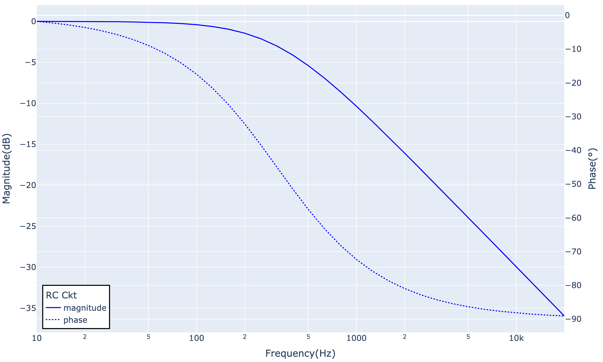

# Little AC Analysis

A simple tool which can do AC Analysis on a circuit, written by Python.

> AC Analysis is a concept from SPICE (Simulation Program with Integrated Circuit Emphasis), which can be simply understood as a tool for obtaining the frequency response of a circuit.

Currently supported components:

- Resistor 
- Potentiometer
- Capacitor
- Inductor
- Ideal Voltage Source
- Ideal Operational amplifier

## How To Use

Let's take a simple first-order RC circuit as an example:



In order to obtain the frequency response at Node 2, we can construct this circuit as follows:

```
from circuit import Circuit, VoltageSource, Resistor, Capacitor

rc_ckt = Circuit(
            components = [ 
                VoltageSource(V=1, nodes=[0, 1]),
                Resistor(R=500e3, nodes=[1, 2]),
                Capacitor(C=1e-9, nodes=[2, 0])
            ],
            output_node = 2,
            name = "RC Ckt")
```

Then we can get the result by calling ac_analysis() of Circuit class

```
freq_list, response_list = rc_ckt.ac_analysis()
```

_freq_list_ contains all the frequencies, and _response_list_ contains the corresponding responses for each frequency.

We can visualize the results using plotting tools, like Plotly: (The image below is generated by [demo.py](./demo.py))


