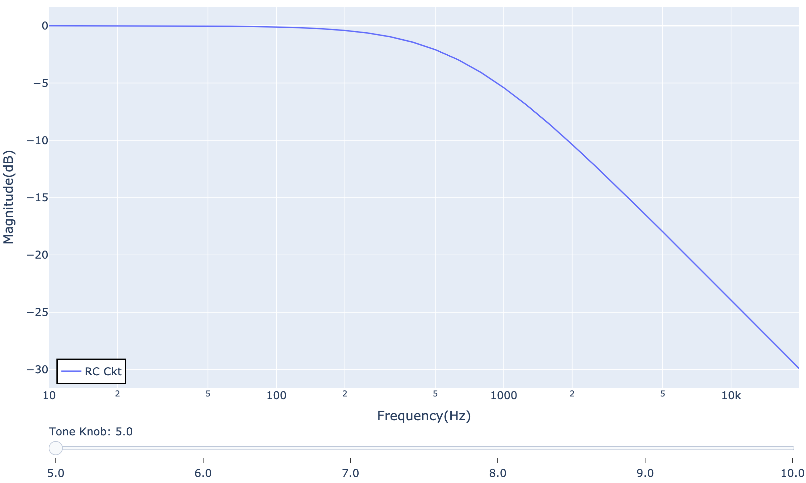

# Little AC Analysis

A simple tool which can do AC Analysis on a circuit, written by Python.

> AC Analysis is a concept from SPICE (Simulation Program with Integrated Circuit Emphasis), which can be simply understood as a tool for obtaining the frequency response of a circuit.

Currently supported components:

- Resistor 
- Potentiometer (See [usage details](#about-potentiometer) below)
- Capacitor
- Inductor
- Ideal Voltage Source
- Ideal Operational amplifier

## Requirements

- **Base Requirement:** The project only requires `numpy` if you're not running the demo.
- **For Demo:** To run the demo, you'll also need `plotly` and `kaleido`.

If you encounter any library compatibility issues, the following package versions have been tested and are known to work:

- Python 3.10.9
- `numpy==1.23.5`
- `plotly==5.23.0`
- `kaleido==0.2.1`

## How To Use

Let's take a simple first-order RC circuit as an example:


In order to obtain the frequency response at Node 2, we can construct this circuit as follows:

```
from circuit import Circuit, VoltageSource, Resistor, Capacitor

rc_ckt = Circuit(
            components = [ 
                VoltageSource(V=1, nodes=[0, 1]),
                Resistor(R=500e3, nodes=[1, 2]),
                Capacitor(C=1e-9, nodes=[2, 0])
            ],
            output_node = 2,
            name = "RC Ckt")
```

Then we can get the result by calling ac_analysis() of Circuit class

```
freq_list, response_list = rc_ckt.ac_analysis()
```

_freq_list_ contains all the frequencies, and _response_list_ contains the corresponding responses for each frequency.

We can visualize the results using plotting tools, like Plotly: (The image below is generated by [demo.py](./demo.py))


We can also create an interactive plot. See [demo-with-slider.py](./demo-with-slider.py) for more details.



## About Potentiometer

The Potentiometer implemented here is roughly referenced from those used in guitar circuits, with _knob_pos_ ranging from 0 to 10.

The Potentiometer class receives one of the input parameters called _nodes_ which is a List containing three elements. Each element corresponds to a terminal in the Potentiometer.

_nodes = [n_0, n_1, n_2]_ means such terminal layout:


As _knob_pos_ decreases, n_1 approaches n_0, reducing the left-side resistance.

Note that the left-side resistance is set to 1 instead of 0 when _knob_pos_ = 0. Similarly, the minimum right-side resistance follows the same rule. Please ensure this aligns with your usage scenario.
